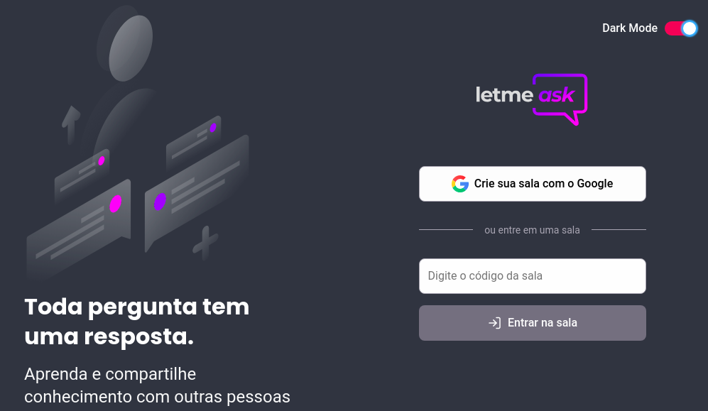

<p align="center">
  
</p>

<p align="center">
  
  
  

     
</p>

<h1 align="center">
    
</h1>

<br>

## 📌 Projeto em desenvolvimento...
<br>

## 🧪 Tecnologias

Esse projeto foi desenvolvido com as seguintes tecnologias:

- [React](https://reactjs.org)
- [Firebase](https://firebase.google.com/)
- [TypeScript](https://www.typescriptlang.org/)
- [Redux](https://redux.js.org/)
- [Storybook](https://storybook.js.org/)
- [Styled-Components](https://styled-components.com/)


## ⚙️ Recursos adicionados ao projeto até o momento
  - Provedor de temas light e dark

## 🚀 Como executar

Clone o projeto e acesse a pasta do mesmo.

```bash
$ git clone https://github.com/jclebson/letmeask
$ cd letmeask
```

Para iniciá-lo, siga os passos abaixo:
```bash
# Instalar as dependências
$ yarn

# Iniciar o projeto
$ yarn dev
```

O app estará disponível no seu browser pelo endereço http://localhost:3000.

Para iniciar o Storybook siga o passo abaixo:
```bash
# Iniciar o storybook
$ yarn storybook
```
O storybook estará acessível pelo endereço http://localhost:6006.

## 💻 Projeto

Este é um projeto desenvolvido durante a **[Next Level Week Together](https://nextlevelweek.com/)**, apresentada dos dias 20 a 27 de Junho de 2021.

## 🔖 Layout

Você pode visualizar o layout do projeto através do link abaixo:

- [Layout Web](https://www.figma.com/file/u0BQK8rCf2KgzcukdRRCWh/Letmeask/duplicate) 

Lembrando que você precisa ter uma conta no [Figma](http://figma.com/).

## 📝 License

Esse projeto está sob a licença MIT. Veja o arquivo [LICENSE](LICENSE.md) para mais detalhes.

---

Feito com 💜 by Jefferson Clebson 👋🏻